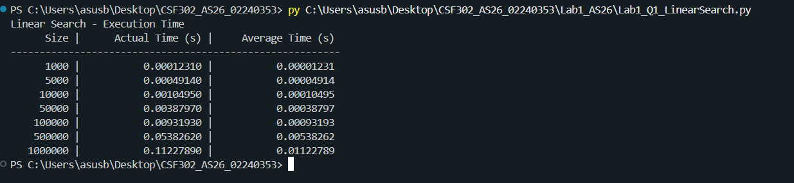
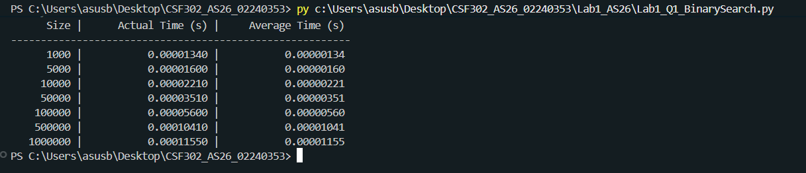
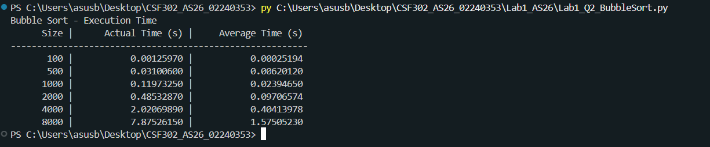
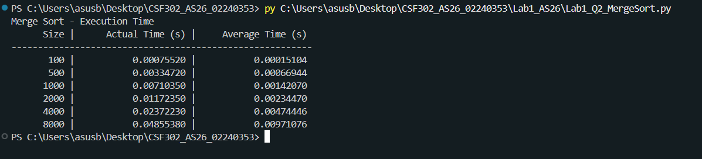
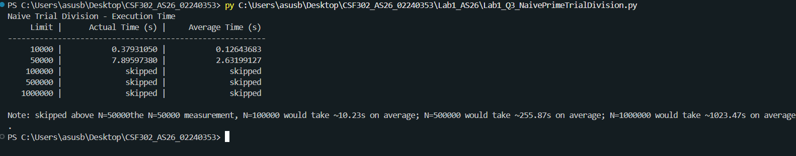
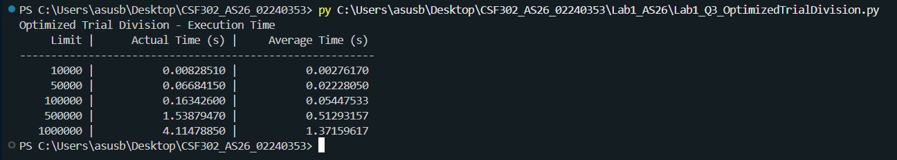
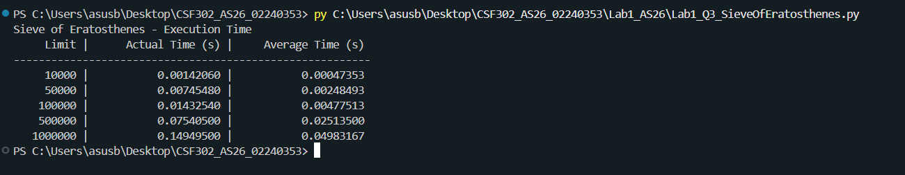

# Lab 1 (AS26) - Output Screenshots

Student number used in code: **353**

Each script below prints its own average execution time table across a
range of input sizes.

## Question 1 - Searching

### 1. Linear Search (average execution time)

### 2. Binary Search (average execution time)

## Question 2 - Sorting

### 1. Bubble Sort (average execution time)

### 2. Merge Sort (average execution time)

## Question 3 - Prime Generation

### 1. Naive Trial Division (average execution time)
> scaling from the N=50,000 measurement: N=100,000 would take ~10.23s on
> average; N=500,000 would take ~255.87s on average; N=1,000,000 would take
> ~1023.47s on average.

### 2. Optimized Trial Division (average execution time)

### 3. Sieve of Eratosthenes (average execution time)

